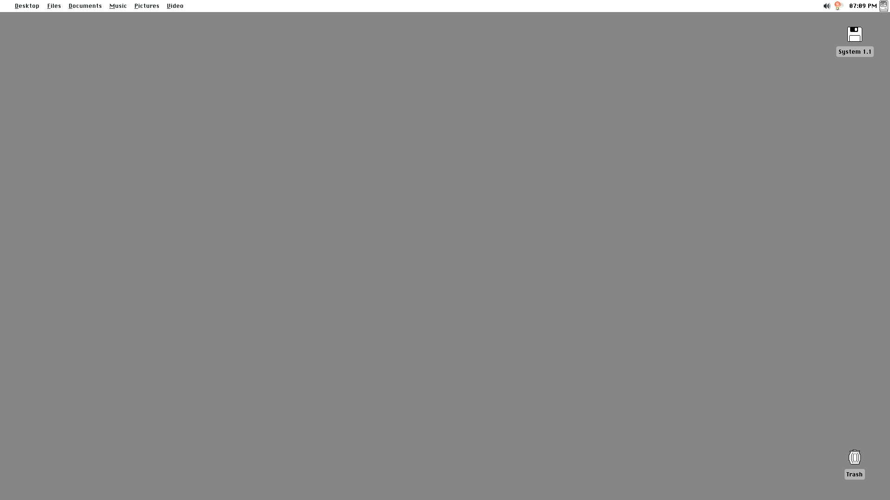
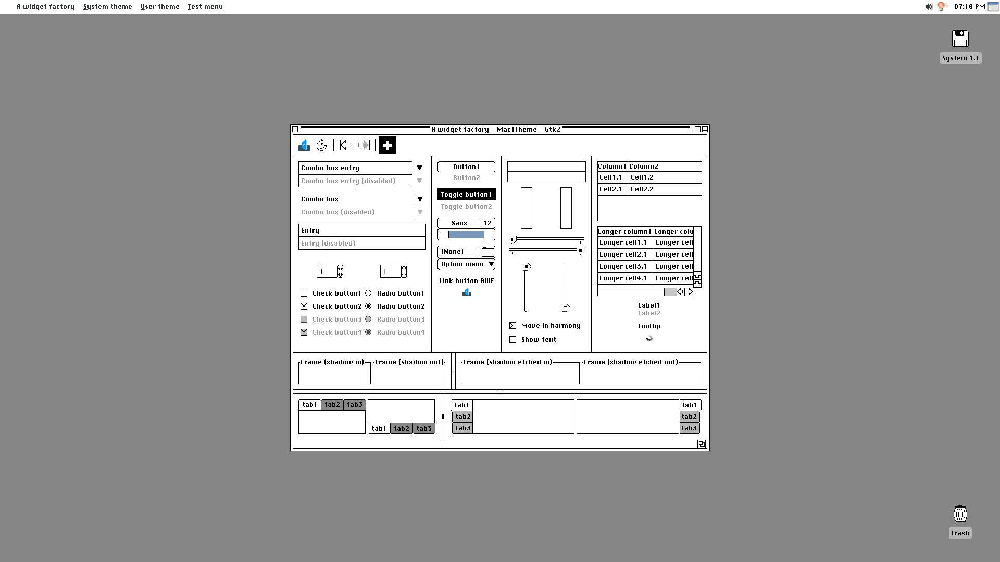
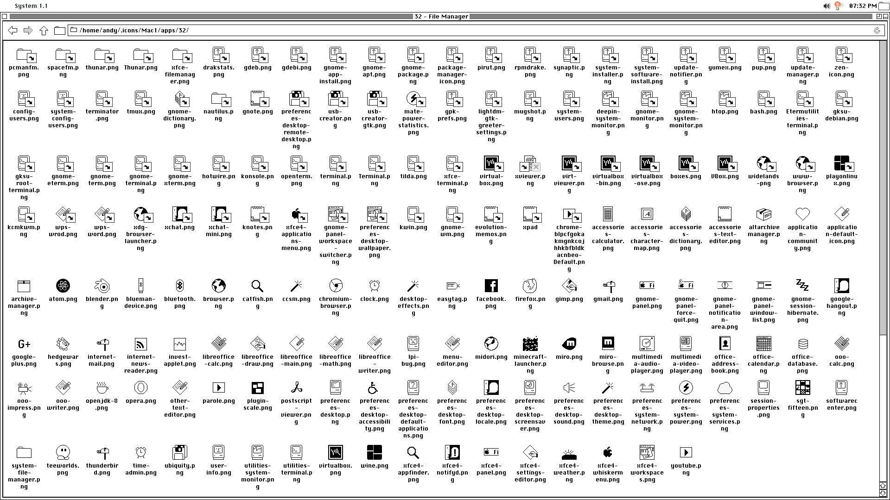

# For the first time... likely...

Here's something you never heard of, or even wanted for that matter:

**A 1984 Macintosh Theme!**

# Why this even exists

Good question.  Honestly, this is more or less for fun.  I really wanted to make my own creation, and this is the result. The only complaints you might have are the lack of true monochrome or unfinished icons.
Likely the latter.

## Screenshots

You saw a blank desktop, well here's something a bit more occupied.
Or as displayed here, an example of the Mac Theme.

And this right here is an exmaple of some of the icons.
The only thing to note is that a good majority are just links to other icons, sometimes to other links.

As you can see, my pixel art skills aren't that too good.  But it's good for a first time.

# Install
So you actually decided to download this?
[Here's the link to the actual guide](INSTALL.md)
